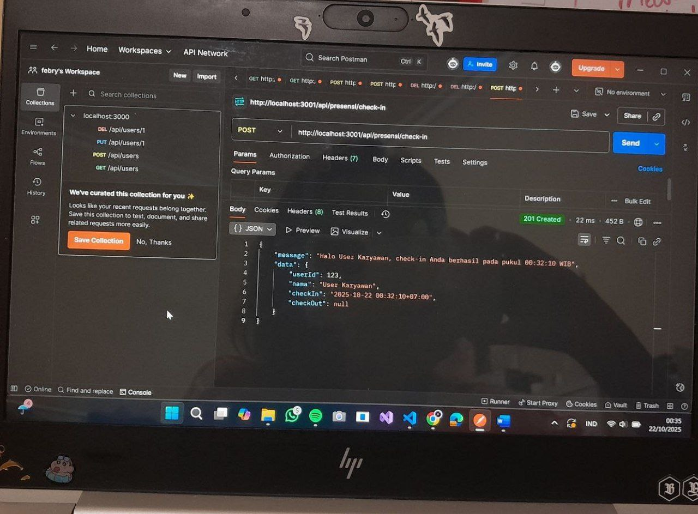
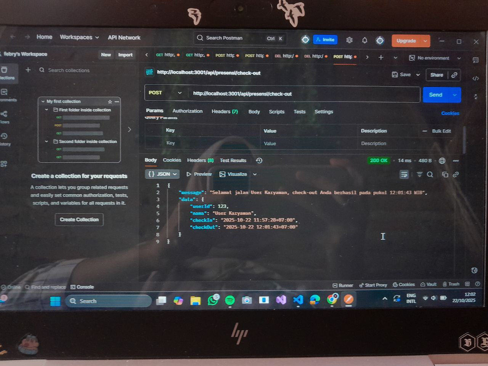

1.Tampilan End Point Check-in:
   
3.Tampilan End Point Check-in lebih 1x:
   
4.Tampilan End Point Chek-out:
   
5.Tampilan End Point Check-out belum check-in:
   
6.Tampilan End Point Report daily Karyawan:
   
7.Tampilan End Point Report daily Admin:
